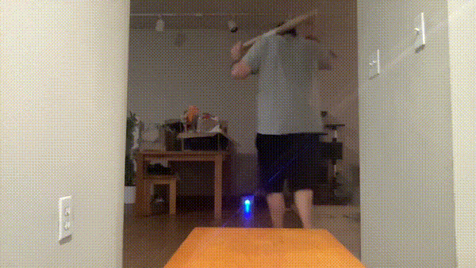
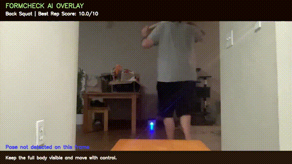
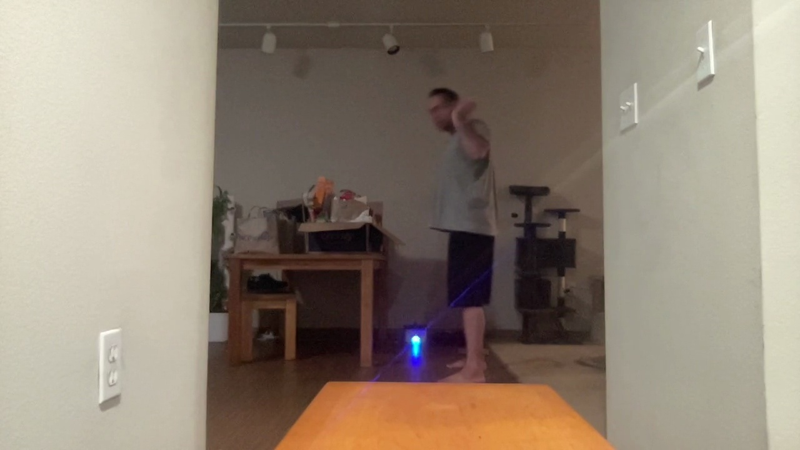
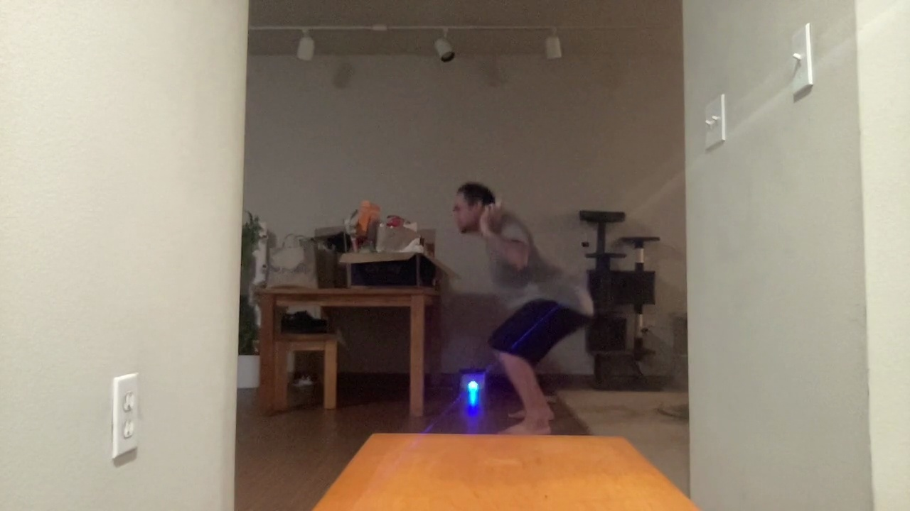
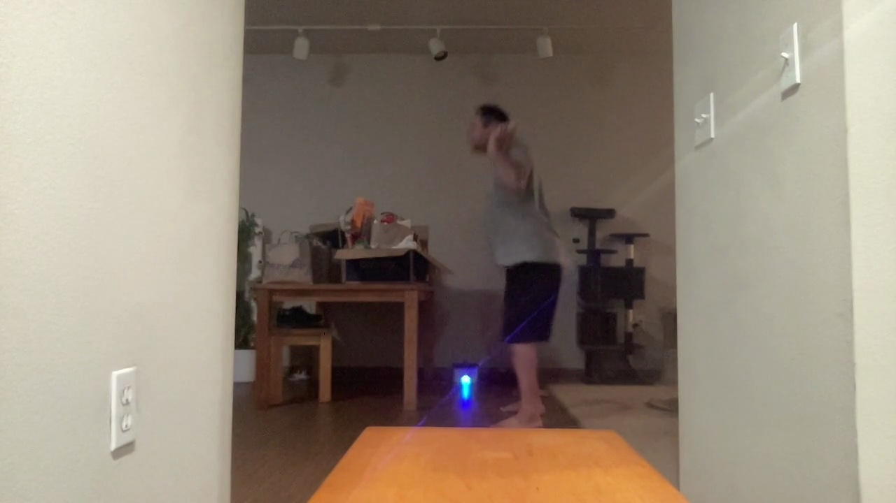

# 🏋️ FormCheck AI

AI-powered exercise analysis platform that uses computer vision, pose estimation, and machine learning to analyze lifting technique from video.

FormCheck AI allows athletes, coaches, and fitness enthusiasts to upload a lifting video and receive detailed feedback on movement quality, rep performance, biomechanics, coaching recommendations, phase-by-phase analysis, and annotated video overlays.

---

# 🚀 Live Features

✅ Exercise Classification

✅ Rep Detection

✅ Rep Scoring

✅ Biomechanics Feedback

✅ Coaching Zones

✅ Set Summaries

✅ Phase Review Images

✅ Overlay Video Generation

✅ Background Overlay Processing

✅ Back Squat Analysis

✅ Front Squat Analysis

✅ Overhead Squat Analysis

✅ Deadlift Analysis

✅ Bench Press Analysis

✅ Push Press Analysis

✅ Strict Press Analysis

✅ Thruster Analysis

✅ Clean Analysis

✅ Snatch Analysis

✅ Split Jerk Analysis

✅ Clean & Jerk Analysis

✅ Mobile & Web Support

---

# Demo

## Back Squat Analysis

### Input Video



---

### Analysis Output

```json
{
  "exercise_label": "Back Squat",
  "confidence": 0.80,
  "analysis_mode": "detailed_rep_analysis",
  "rep_feedback": [
    {
      "rep": 1,
      "score": 8.2,
      "grade": "Good",
      "issues": [
        "Depth is close, but could be slightly lower.",
        "Knees cave inward noticeably."
      ]
    }
  ]
}
```

---

### Overlay Analysis



---

### Phase Review

| Setup | Descent | Bottom | Ascent | Lockout |
|--------|--------|--------|--------|--------|
|  |  |  |  |  |

---

# Current Supported Movements

## Detailed Rep Analysis

### Squat Family

- Back Squat
- Front Squat
- Overhead Squat

### Pressing

- Strict Press
- Push Press
- Thruster

### Strength

- Bench Press
- Deadlift

### Olympic Weightlifting

- Clean
- Split Jerk
- Clean & Jerk
- Snatch

Each movement includes:

- Rep Detection
- Rep Scoring
- Coaching Zones
- Set Summary
- Biomechanics Feedback
- Phase Review Images

---

# What FormCheck AI Analyzes

## Rep Detection

Automatically identifies:

- Rep start
- Eccentric phase
- Bottom position
- Concentric phase
- Lockout
- Rep completion

Returns:

- Total reps
- Best rep
- Worst rep
- Average score
- Consistency trend

---

## Biomechanics Feedback

### Squat Analysis

- Depth assessment
- Knee valgus detection
- Forward torso lean
- Heel rise detection

### Deadlift Analysis

- Back rounding
- Hip hinge quality
- Lockout analysis
- Bar path tracking

### Bench Press Analysis

- Range of motion
- Stability assessment
- Lockout quality

### Push Press Analysis

- Dip quality
- Timing analysis
- Overhead lockout
- Bar path tracking

### Strict Press Analysis

- Knee bend detection
- Overhead lockout
- Torso positioning
- Head position at lockout

### Thruster Analysis

- Squat depth
- Torso position
- Overhead lockout
- Bar path
- Rep scoring

### Clean Analysis

- First pull quality
- Extension quality
- Turnover timing
- Front rack position
- Catch position
- Bar path tracking

### Snatch Analysis

- First pull quality
- Extension quality
- Turnover timing
- Overhead catch stability
- Overhead positioning
- Bar path tracking

### Split Jerk Analysis

- Dip quality
- Drive quality
- Overhead lockout
- Split receiving position
- Torso stacking
- Bar path tracking

### Clean & Jerk Analysis

- Clean phase scoring
- Jerk phase scoring
- Combined movement scoring
- Clean catch analysis
- Jerk receiving analysis
- Coaching zones

---

# Coaching Zones

FormCheck AI generates exercise-specific coaching zones that identify strengths and weaknesses across a set.

Examples include:

### Squat Family

- Depth
- Knees
- Torso
- Heels
- Neck

### Deadlift

- Back
- Hip Hinge
- Knees
- Bar Path
- Lockout

### Bench Press

- Elbows
- Depth
- Lockout
- Arch
- Leg Drive

### Push Press / Strict Press / Thruster

- Dip
- Dip Path
- Timing
- Bar Path
- Lockout
- Finish

### Clean

- First Pull
- Extension
- Turnover
- Catch
- Front Rack
- Bar Path

### Snatch

- First Pull
- Extension
- Turnover
- Overhead Catch
- Stability
- Bar Path

### Split Jerk

- Dip
- Drive
- Lockout
- Split Catch
- Torso Stack
- Bar Path

### Clean & Jerk

- Clean First Pull
- Clean Extension
- Clean Turnover
- Clean Catch
- Jerk Dip
- Jerk Drive
- Jerk Lockout
- Jerk Catch
- Jerk Bar Path

---

# Visual Feedback

## Phase Review

Generates key movement snapshots.

### Squat

- Setup
- Descent
- Bottom
- Ascent
- Lockout

### Deadlift

- Setup
- Pull
- Mid-Pull
- Finish
- Lockout

### Push Press / Strict Press / Thruster

- Setup
- Dip
- Drive
- Catch
- Lockout

### Clean

- Setup
- First Pull
- Extension
- Catch
- Finish

### Snatch

- Setup
- First Pull
- Extension
- Catch
- Finish

### Split Jerk

- Setup
- Dip
- Drive
- Catch
- Recovery
- Finish

### Clean & Jerk

- Setup
- First Pull
- Extension
- Clean Catch
- Jerk Dip
- Jerk Drive
- Jerk Catch
- Finish

---

## Overlay Video Generation

FormCheck AI generates annotated replay videos showing:

- Rep boundaries
- Rep scores
- Coaching notes
- Movement analysis
- Exercise classification

Overlay rendering is performed asynchronously using background processing jobs.

Currently supported for:

- Back Squat
- Front Squat
- Overhead Squat
- Deadlift
- Bench Press
- Push Press
- Strict Press
- Thruster

---

# Architecture

```text
Video Upload
      ↓
MediaPipe Pose
      ↓
Landmark Extraction
      ↓
Feature Engineering
      ↓
Movement Classification
      ↓
Rep Detection
      ↓
Biomechanics Analysis
      ↓
Feedback Generation
      ↓
Coaching Zones
      ↓
Phase Images
      ↓
Start Overlay Job
      ↓
Background Overlay Worker
      ↓
Overlay Status Polling
      ↓
Overlay Video
```

---

# Tech Stack

## Backend

- FastAPI
- Python
- TensorFlow / Keras
- MediaPipe
- OpenCV
- NumPy
- Pandas

## Frontend

- React Native
- Expo
- expo-video

## Machine Learning

- LSTM Sequence Models
- Pose Landmark Extraction
- Feature Engineering
- Movement Routing Models
- Biomechanics Rule Engine

## Deployment

### Frontend

- Vercel

### Backend

- AWS Elastic Beanstalk
- Docker

### Inference

- TensorFlow
- MediaPipe

---

# API Endpoints

## Health Check

```http
GET /health
```

Returns:

```json
{
  "status": "ok",
  "model_loaded": true
}
```

---

## Analyze Video

```http
POST /analyze
```

Returns:

- exercise_label
- confidence
- feedback
- rep_feedback
- set_summary
- coaching_zones
- phase_images

Example:

```json
{
  "exercise_label": "Back Squat",
  "confidence": 0.80,
  "analysis_mode": "detailed_rep_analysis"
}
```

---

## Generate Phase Review

```http
POST /generate_visuals
```

Creates:

- Phase review images
- Movement snapshots
- Exercise-specific breakdowns

---

## Start Overlay Job

```http
POST /start_overlay
```

Returns:

```json
{
  "job_id": "1d76ef7edce7",
  "status": "processing"
}
```

---

## Overlay Status

```http
GET /overlay_status/{job_id}
```

Returns:

```json
{
  "status": "ready",
  "overlay_video_url": "/outputs/overlay_ab14dd6d.mp4"
}
```

---

# Installation

## Clone Repository

```bash
git clone https://github.com/kamilj62/FormCheckAI.git

cd FormCheckAI
```

---

## Backend Setup

```bash
cd backend

python3 -m venv .venv
source .venv/bin/activate

pip install -r requirements.txt

uvicorn app.main:app --reload
```

Backend:

```text
http://127.0.0.1:8000
```

Swagger Docs:

```text
http://127.0.0.1:8000/docs
```

---

## Mobile Setup

```bash
cd mobile

npm install

npx expo start
```

Supported Platforms:

- iPhone
- Android
- Expo Go
- Web Browser

---

# Example Response

```json
{
  "exercise_label": "Clean and Jerk",
  "confidence": 0.63,
  "analysis_mode": "detailed_rep_analysis",
  "set_summary": {
    "detected_reps": 1,
    "avg_rep_score": 9.2
  }
}
```

---

# Roadmap

## Olympic Lift Improvements

- Olympic Lift Overlay Videos
- Olympic Lift Phase-Specific Coaching Images
- Multi-Rep Olympic Lift Detection
- Improved Clean & Jerk Segmentation
- Improved Snatch Stability Analysis

## New Movements

- Power Clean
- Hang Clean
- Push Jerk
- Front Rack Carry

## Platform Features

- Athlete History
- Coach Dashboard
- Team Analytics
- Performance Trends
- Movement Comparison
- Expanded CrossFit Exercise Library

---

# Author

## Joseph Kamil

AI Engineer | Full Stack Developer

University of Michigan

GitHub:

https://github.com/kamilj62

---

FormCheck AI currently provides detailed AI-driven analysis for:

- Back Squat
- Front Squat
- Overhead Squat
- Bench Press
- Deadlift
- Push Press
- Strict Press
- Thruster
- Clean
- Split Jerk
- Clean & Jerk
- Snatch

including:

- Rep Detection
- Rep Scoring
- Coaching Zones
- Set Summaries
- Phase Review Images
- Biomechanics Feedback

Built using computer vision, machine learning, biomechanics analysis, and modern AI tooling to help athletes move better.